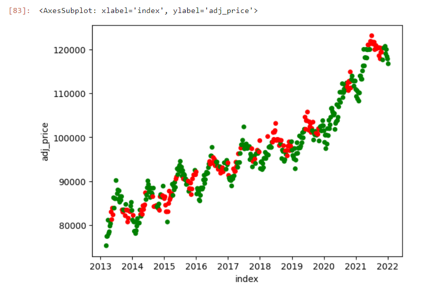

# Aperçu du Projet
Ceci est un projet d'apprentissage automatique permettant de prédire les futures prix des maisons utilisant **JupyerLab et les bibliothèques Python (pandas, yfinance, scikit-learn).** 

Ce projet se base sur les **données de la Réserve fédérale**, ainsi que des **données sur les prix des maisons de Zillow**. Nous fusionnerons et combinerons ces données, puis les utiliserons pour entraîner un modèle de forêt aléatoire. Le modèle prédira si les prix des maisons augmenteront ou diminueront à l'avenir. Nous mesurerons l'erreur en utilisant le backtesting, puis améliorerons notre modèle avec de nouveaux prédicteurs.

Le projet est personnalisé pour prédire les prix des maisons de l'ensemble des États-Unis.

## Étapes du projet
1. Chargement des données
2. Nettoyage et fusion des données
3. Création d'un modèle d'apprentissage automatique initial et estimation de l'exactitude
4. Calcul et amélioration de l'exactitude du modèle
5. Exécution de diagnostics pour déterminer comment nous pouvons améliorer le modèle dans l'avenir.

## Comment exécuter le projet ?
1. Télécharger les suivants dans votre environnement local :
    - Jupyterlab
    - Python 3.8+
    - Librairies Python (pandas, yfinance, scikit-learn)
    
2. Cloner le projet dans votre environnement local.
3. Dans le repértoire du projet, exécuter la commande suivante : 

```
jupyter lab
```

Le code source de projet se trouve dans le fichier **home_prices_prediction.ipynb**.


## Explication du projet

Après avoir complété les étapes de chargement, fusion et nettoyage des données, nous nous retrouvons avec les données suivantes : 


Ce tableau comprend les données suivantes : 
-   Le taux d'intérêt.
-   Le taux de logements vacants.
-   CPI (Consumer Price Index) ou Indice des prix à la consommation.
-   Le prix moyen des maisons.
-   La valeur moyenne des maisons.

Le graphique suivant représente le prix des maisons entre 2008 et 2022. 


Le modèle prends en considération le CPI. Donc les valeurs ont été normalisées en fonction de CPI dans le graphique suivant : 


L'étape suivante consiste à construire le modèle d'apprentissage automatique. Dans un premier temps, on définit les prédicteurs et la cible que le modèle utilisera pour faire des prévisions. Les prédicteurs sont les variables d'entrée du modèle, tandis que la cible est la variable que le modèle tentera de prédire.

Les prédicteurs sont : 
-   Le taux d'intérêt.
-   Le taux de logements vacants.
-   Le prix ajusté des maisons.
-   La valeur ajustée des maisons.

La cible est le changement des prix.

Le modèle d'apprentissage automatique est basé sur RandomForestClassifier pour faire des prévisions sur un ensemble de données et évalue ses performances à l'aide d'une validation croisée.

On observe **une exactitude de 58%.**


Après les améliorations, en tenant compte des ratios annuels des prix, on réussit à **monter la précision à 64%. C'est-à-dire le modèle est capable de prédire les prix des maisons correctement dans 64% des cas.**

Le modèle peut davantage être exploré pour chercher comment il peut être amélioré.

Le nuage de points (scatter plot) suivant indique pour quelles valeurs le modèle réussit ou non à prédire correctement les prix des maisons. La couleur de chaque point est déterminée par les valeurs de pred_match, qui indiquent si le modèle a fait une prédiction correcte ou non pour chaque observation. **Les points correctement prédits sont affichés en vert et les points mal prédits en rouge.**



Vous pouvez cloner ce projet et continuer de l'améliorer.


